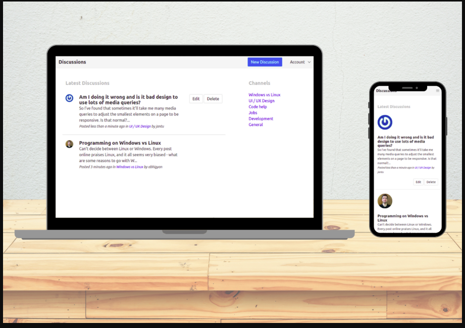

# Project :  Discussion Forum
Discussion Forum is a forum built with Ruby on Rails and Bulma that lets users sign up and join a discussion. Users can also create a new discussion where other users can comment. Users can only edit or delete their discussions. Only admins can create new categories for discussions. This was built using Ruby On Rails, PostgreSQL, and Bulma.



## Live Demo

[Live Demo Link](https://rails-discussion-forum.herokuapp.com/)

## Build-With

- Ruby -v 2.6.3
- Rails -v 5.2.0
- Postgresql
- Atom

## Getting Started

### Prerequisites

To get this project up and running locally, you must already have ruby and necessary gems installed on your computer

**To get this project set up on your local machine, follow these simple steps:**

1. Open Terminal.
2. Navigate to your desired location to download the contents of this repository.
3. Copy and paste the following code into the Terminal: git clone https://github.com/Abhigyan001/discussion_forum
4. Run ```cd discussion_forum```.
5. Run ```bundle install``` to get the necesary gems.
6. Run `rails db:create`.
6. Run `rails db:migrate`.
7. Run `rails server`


## Author Details::

👤 ABHIGYAN Mahanta

- Github: [@Abhigyan001](https://github.com/Abhigyan001)
- Twitter: [@abhigyan_001](https://twitter.com/abhigyan_001)
- LinkedIn: [Abhigyan](https://www.linkedin.com/in/abhigyanmahanta/)

## Show your support

Give ⭐ Star me on GitHub — it helps!

## 📝 License

This project is [MIT](lic.url) licensed.
